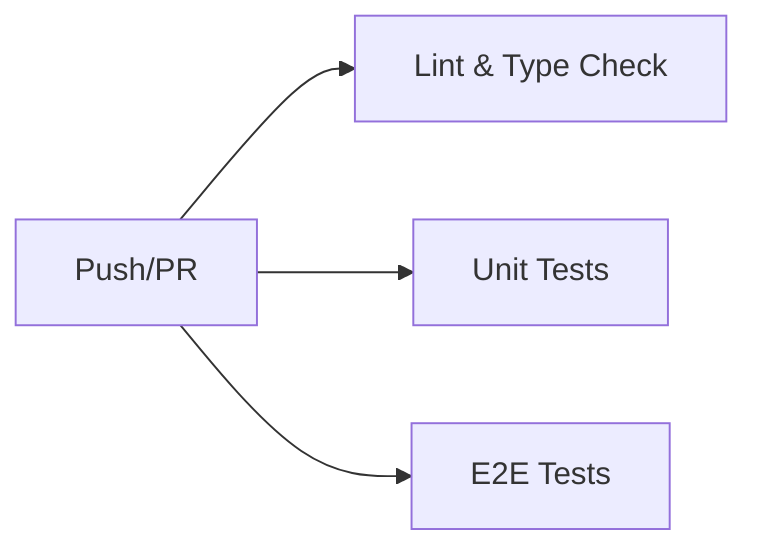
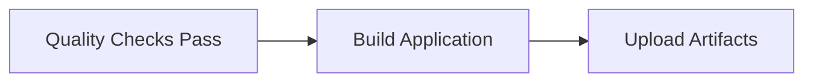
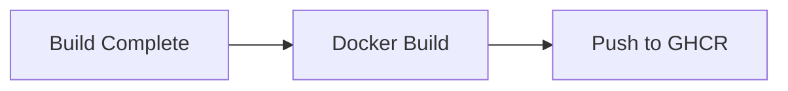
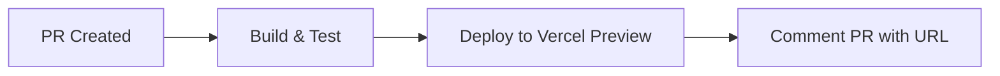
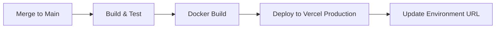

# CI/CD Pipeline - Enterprise Deployment Guide

## 🏗️ Architecture Overview

This repository uses a production-grade CI/CD pipeline with:
- **Security**: Least-privilege permissions, OIDC authentication
- **Quality Gates**: Linting, type checking, unit tests, E2E tests
- **Deployment**: Automated preview and production deployments
- **Monitoring**: Build artifacts, test reports, coverage tracking

## 📋 Prerequisites

### 1. GitHub Repository Settings

#### Required Environments
Create these environments in **Settings → Environments**:

1. **Preview**
   - Protection rules: None (auto-deploy on PR)
   - Deployment branches: All branches
   
2. **Production**
   - Protection rules: 
     - ✅ Required reviewers (1-2 approvers)
     - ✅ Wait timer: 5 minutes
     - ✅ Deployment branches: `main` only
   - Environment secrets (see below)

#### Required Secrets
Add these in **Settings → Secrets and variables → Actions**:

**Repository Secrets:**
```
VERCEL_TOKEN          # Vercel API token
VERCEL_ORG_ID         # Vercel organization ID
VERCEL_PROJECT_ID     # Vercel project ID
CODECOV_TOKEN         # (Optional) Codecov upload token
```

**Repository Variables:**
```
POCKETBASE_URL        # PocketBase API URL (e.g., https://api.example.com)
```

### 2. Vercel Setup

1. **Generate Vercel Token**:
   ```bash
   # Visit: https://vercel.com/account/tokens
   # Create token with scope: Full Account
   ```

2. **Get Organization & Project IDs**:
   ```bash
   # Install Vercel CLI
   npm i -g vercel
   
   # Login and link project
   vercel login
   vercel link
   
   # Get IDs from .vercel/project.json
   cat .vercel/project.json
   ```

### 3. GitHub Container Registry (GHCR)

Enable **Packages** in repository settings:
- Settings → General → Features → ✅ Packages

The workflow uses `GITHUB_TOKEN` (auto-provided) for GHCR authentication.

## 🔄 Workflow Stages

### Stage 1: Quality Checks (Parallel)


**Runs on**: All pushes and PRs  
**Duration**: ~3-5 minutes  
**Artifacts**: Coverage reports, test results

### Stage 2: Build


**Runs on**: After quality checks pass  
**Duration**: ~2-3 minutes  
**Artifacts**: Production build (`build/`)

### Stage 3: Docker (Main Branch Only)


**Runs on**: Push to `main` only  
**Duration**: ~5-7 minutes  
**Output**: `ghcr.io/[org]/[repo]:latest`

### Stage 4: Deployment

#### Preview Deployment (PRs)


**Triggers**: Pull request creation/update  
**Environment**: Preview  
**URL**: Auto-generated Vercel preview URL

#### Production Deployment (Main)


**Triggers**: Push to `main` branch  
**Environment**: Production  
**Protection**: Requires approval + 5min wait  
**URL**: Your production domain

## 🔒 Security Features

### Least-Privilege Permissions
```yaml
permissions:
  contents: read        # Read repository code
  packages: write       # Push Docker images
  pull-requests: write  # Comment on PRs
  deployments: write    # Create deployments
  id-token: write       # OIDC authentication
```

### Concurrency Control
```yaml
concurrency:
  group: ${{ github.workflow }}-${{ github.ref }}
  cancel-in-progress: true  # Cancel old runs (except main)
```

Prevents:
- Multiple deployments to same environment
- Resource waste from duplicate builds
- Race conditions in deployment state

### Dependency Security
- **Frozen lockfile**: `pnpm install --frozen-lockfile`
- **Checksum verification**: pnpm validates package integrity
- **Audit on install**: Automatic vulnerability scanning

## 📊 Monitoring & Observability

### Build Artifacts
- **Coverage reports**: 7-day retention
- **Playwright reports**: 7-day retention
- **Build output**: 7-day retention

### Deployment Tracking
- **Environment URLs**: Tracked in GitHub Deployments
- **Deployment history**: Full audit trail
- **Rollback capability**: Via GitHub Deployments UI

## 🚀 Usage

### Automatic Workflows

**On Pull Request:**
1. Quality checks run automatically
2. Preview deployment created
3. PR comment added with preview URL
4. Status checks block merge if failing

**On Merge to Main:**
1. Full test suite runs
2. Docker image built and pushed
3. Production deployment initiated
4. Requires manual approval (if configured)
5. 5-minute wait timer before deployment

### Manual Deployment

Trigger workflow manually:
```bash
# Via GitHub UI: Actions → CI/CD Pipeline → Run workflow

# Or via GitHub CLI:
gh workflow run ci.yml --ref main
```

## 🔧 Troubleshooting

### "Environment not found" Error
**Solution**: Create environments in repository settings (see Prerequisites)

### "Secret not found" Error
**Solution**: Add required secrets to repository settings

### Vercel Deployment Fails
**Checks**:
1. Verify `VERCEL_TOKEN` is valid
2. Confirm `VERCEL_ORG_ID` and `VERCEL_PROJECT_ID` are correct
3. Check Vercel project exists and is linked

### Docker Push Fails
**Checks**:
1. Verify Packages feature is enabled
2. Confirm workflow has `packages: write` permission
3. Check GHCR authentication in workflow logs

### Tests Fail in CI but Pass Locally
**Common causes**:
1. Missing environment variables
2. Timezone differences (use UTC in tests)
3. Race conditions (add proper waits in E2E tests)
4. File system case sensitivity (macOS vs Linux)

## 📈 Performance Optimization

### Caching Strategy
- **pnpm cache**: Node modules cached by hash
- **Playwright browsers**: Cached between runs
- **Docker layers**: BuildKit cache for faster builds

### Parallel Execution
- Lint, unit tests, and E2E tests run in parallel
- Reduces total pipeline time by ~40%

### Artifact Optimization
- Only essential files uploaded
- 7-day retention (configurable)
- Compressed artifacts for faster downloads

## 🔄 Maintenance

### Updating Dependencies
```bash
# Update GitHub Actions
dependabot.yml # Configure Dependabot for Actions

# Update pnpm version
# Edit .github/workflows/ci.yml:
env:
  PNPM_VERSION: '9'  # Update version here
```

### Monitoring Pipeline Health
- Review failed workflow runs weekly
- Check artifact storage usage monthly
- Update action versions quarterly

## 📚 Additional Resources

- [GitHub Actions Documentation](https://docs.github.com/en/actions)
- [Vercel CLI Documentation](https://vercel.com/docs/cli)
- [pnpm Documentation](https://pnpm.io)
- [Playwright Best Practices](https://playwright.dev/docs/best-practices)

---

**Last Updated**: 2026-03-01  
**Maintained by**: Engineering Team  
**Support**: Create an issue in this repository
